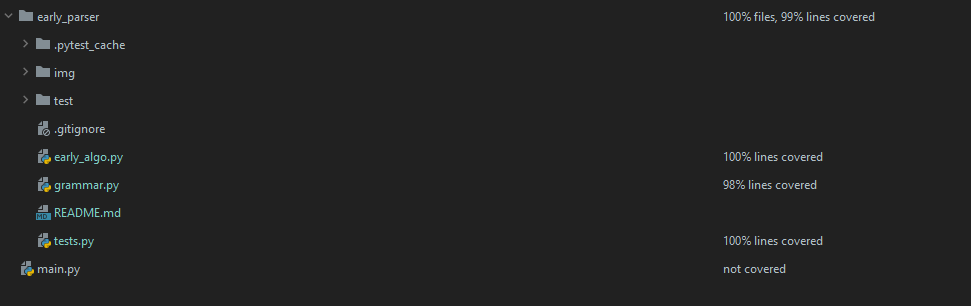

# Early parser
___
## Описание:
Парсер работает по [Алгоритму Эрли](https://ru.wikipedia.org/wiki/%D0%90%D0%BB%D0%B3%D0%BE%D1%80%D0%B8%D1%82%D0%BC_%D0%AD%D1%80%D0%BB%D0%B8)
**Алгоритм Эрли** позволяет определить, выводится ли данное слово **w** в данной контекстно-свободной грамматике **G**.

#### Вход для алгоритма: КС грамматика **G = ⟨N, Σ, P, S⟩** и слово w.
#### Выход: `true`, если **w** выводится в **G**; `false` — иначе.

## Входные данные:
Программа получает данные считывая их с файла.
Входные данные - правила вида:`S -> AaB`  -где `S` стартовый символ, `A, B`-нетерминалы, а `a`- терминал. 
Выводит `Yes` - если слово принадлежит КС-языку задаваемой грамматикой, иначе выведет `No`.

Тестирование осуществлялось c помощью модуля `Pytest`.

## Запуск программы:
Чтобы запустить программу достаточно ввести следующую команду в терминале:

`python3 main.py`
или `python main.py`

Для запуска тестов введите:
``python3 tests.py``

